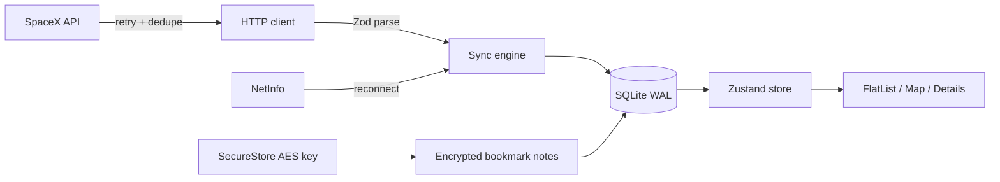
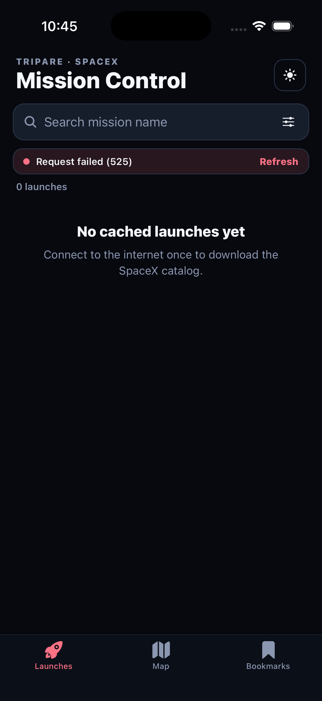
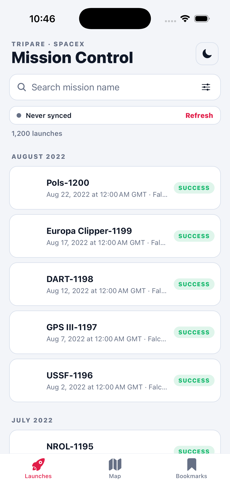
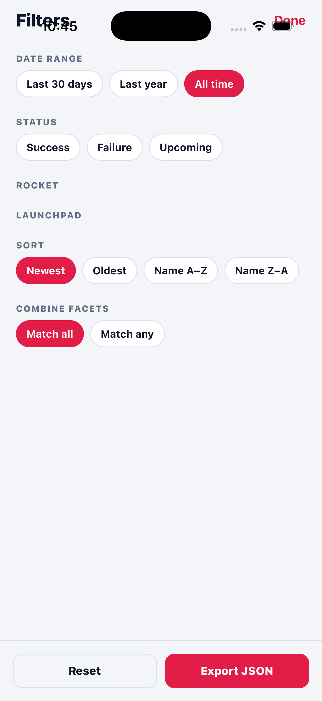
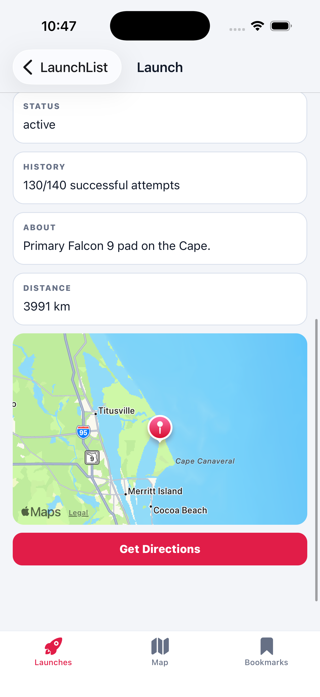
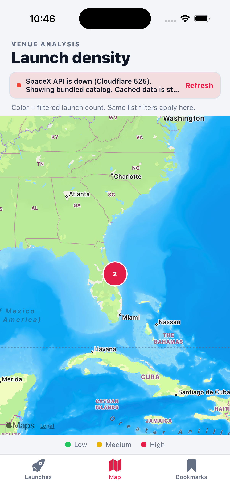
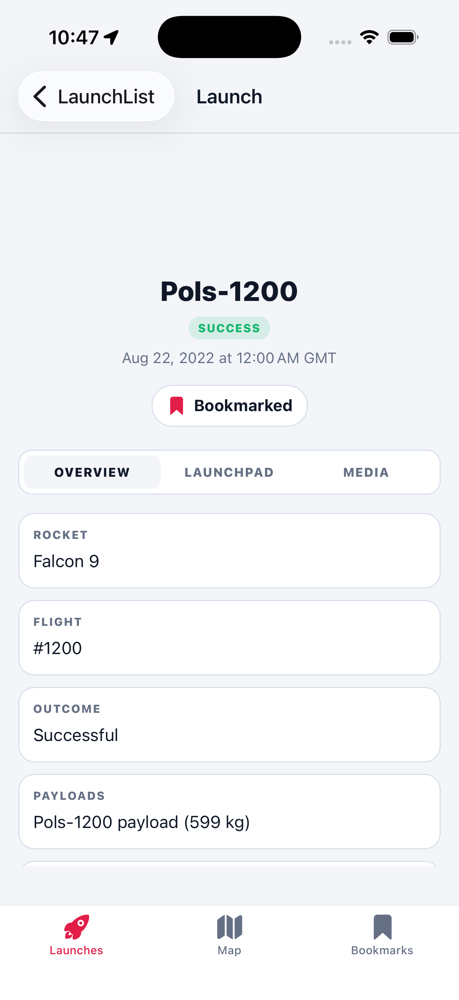

# Tripare SpaceX Mission Control

Production-style React Native (Expo + TypeScript) app for browsing 1,000+ SpaceX launches offline-first, analyzing launchpad density on a clustered map, and keeping encrypted private notes.

## Quick Start

```bash
npm install
cp .env.example .env
npm test
npm run ios      # or: npm run android
```

Expo Go works for the list, details, bookmarks, offline cache, and filters. Maps use `react-native-maps` (Apple Maps on iOS; Android may need a Google Maps key for tiles).

Expected first-run time: under 3 minutes if Node 20+ and Xcode/Android Studio are already installed.

## Architecture Overview

The app treats **SQLite as the source of truth**. On launch it hydrates a normalized Zustand store from disk so the UI is interactive before the network returns. A background sync then pulls SpaceX v5 launches plus v4 launchpads/rockets/payloads, validates each row with Zod, upserts SQLite, and refreshes the store.



Offline is not a special mode: if the fetch fails, cached rows stay on screen and a banner explains the failure. When NetInfo reports connectivity again, sync resumes automatically.

## Key Technical Decisions

- **State:** Zustand. The catalog is normalized (`launches[id]`) so list, map, and details share one copy of 1,000+ records without Context rerender storms. UI filters live in the same store with selectors.
- **Database:** `expo-sqlite` with WAL, indexed `date_unix` / name / rocket / pad columns, and `PRAGMA user_version` migrations. SQLite beats AsyncStorage for this catalog size; WatermelonDB would add sync machinery we do not need for a read-mostly dataset.
- **Offline sync:** cache-first hydrate, then network refresh with `Promise.allSettled` for enrichment endpoints. Launches are required; pads/rockets/payloads are best-effort so a partial outage still yields a usable app.
- **Map clustering:** greedy haversine clustering whose radius scales with `latitudeDelta`. SpaceX only has ~15 pads, but CCAFS SLC-40 and KSC LC-39A sit a few kilometers apart, so zoomed-out view collapses them instead of stacking pins.
- **HTTP:** custom client (not React Query) so SQLite remains the only durable cache. The client still does timeout, exponential backoff, and in-flight dedupe.
- **Notes:** AES via `crypto-js`, key in SecureStore (`WHEN_UNLOCKED_THIS_DEVICE_ONLY`). Ciphertext lives in SQLite; plaintext never does.

## Performance Report

See [docs/PERFORMANCE.md](docs/PERFORMANCE.md) for the measurement method, list virtualization settings, memory budget, and bundle notes.

The list uses a virtualized `FlatList` with **fixed row/header heights and `getItemLayout`**, `windowSize={7}`, and `expo-image` disk+memory caching with a memory clear when the app backgrounds.

Filter + group of 1,200 launches is covered by a unit test that must finish in under 50ms (well inside a 16ms-per-frame *work* budget for this CPU-bound step).

## Testing

```bash
npm test
npm run test:coverage
```

Covered scenarios:

- Search, date presets, multi-select facets, AND/OR combine mode, sort + sticky grouping
- Haversine distance and pad clustering / density colors
- Exponential backoff + jitter
- Zod collection parsing that skips bad rows
- HTTP retry, timeout error mapping, request dedupe
- AES note round-trip
- Relative “Last synced …” copy

## Screenshots

| Screen | Preview |
| --- | --- |
| Launch list (dark) |  |
| Launch list (light, 1,200 launches) |  |
| Filters |  |
| Launch details + launchpad map |  |
| Heatmap / launch density |  |
| Launch overview |  |

## Known Limitations & Trade-offs

- SpaceX’s public API (`api.spacexdata.com`) currently returns **HTTP 525** (Cloudflare cannot handshake with origin). The app then loads a **bundled 1200-launch catalog** so the UI, filters, and map still work. When the API recovers, pull-to-refresh replaces the snapshot with live data.
- Payload details come from `/v4/payloads` in bulk rather than per-launch N+1 calls. If that endpoint fails, the Overview tab falls back to payload ids.
- Android Google Maps tiles need an API key in `app.json` for production. iOS uses Apple Maps without a key.
- Profiler / memory screenshots are environment-specific; the commands to capture them are in `docs/PERFORMANCE.md`.
- Expo Go on some SDK versions has limited `react-native-maps` support; a dev client (`npx expo run:ios`) is the reliable maps path.
- With more time: Detox/Maestro e2e, Sentry, WatermelonDB if writes grow, FlashList if row complexity increases, and a bundled launch snapshot for first-run airplane-mode demos.
